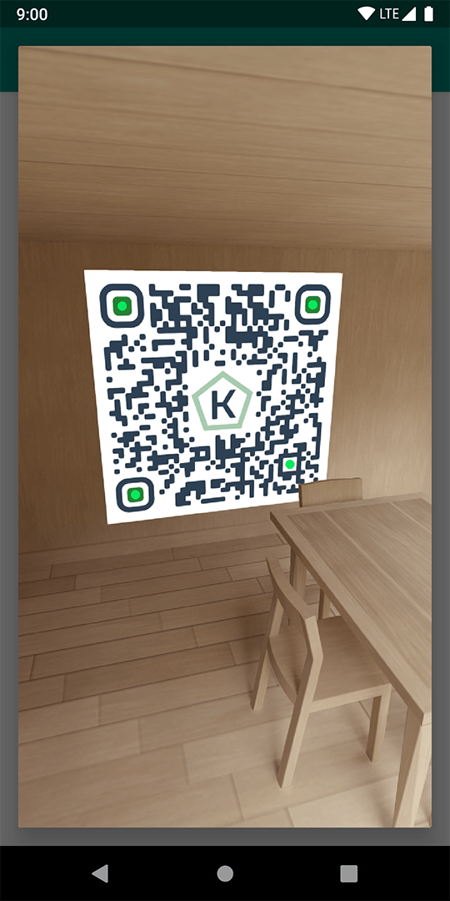
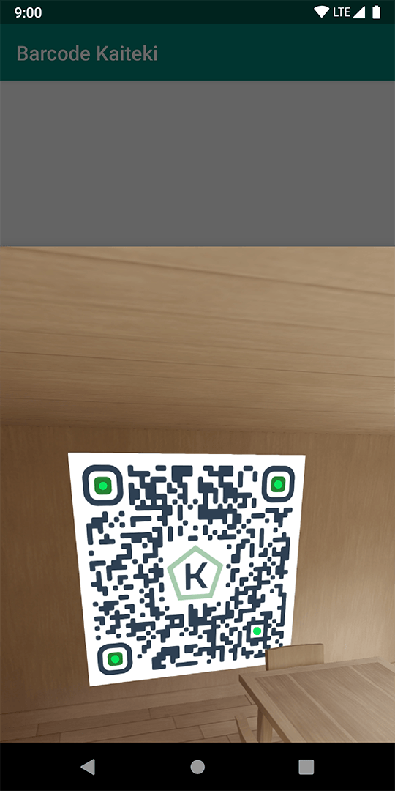
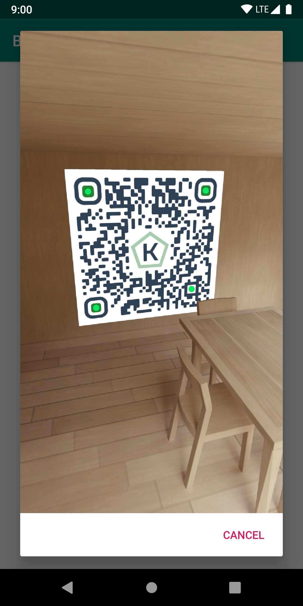

| Artifact | Version |
|:-|:-:|
| com.kroegerama:barcode-kaiteki | [](https://search.maven.org/artifact/com.kroegerama/barcode-kaiteki) |


## Barcode-Kaiteki


An easy to use library for barcode detection. Based on the new **AndroidX** **Camera2** api. Uses the **zxing** barcode detection library.

Comes with a **BarcodeView**, which combines a camera preview and an automatic overlay for detected barcodes.

#### Also contains three differend ready to use dialogs:

* **BarcodeDialog** *(DialogFragment)*
* **BarcodeBottomSheet** *(BottomSheetDialogFragment)*
* **BarcodeAlertDialog** *(AlertDialog)*
* **BarcodeFragment** *(Fragment)*

&emsp;&emsp;

#### Features

* camera permission handling
* customize the displayed result points
* customize the barcode type (can be a list)
* allows scanning of inverted barcodes (white barcode on black background)

#### Add library dependency

barcode-kaiteki is distributed via MavenCentral. Just add it a as a dependency:

```gradle
dependencies {
    implementation("com.kroegerama:barcode-kaiteki:<version>")
}
```

#### Usage

##### BarcodeDialog

Just let your Activity/Fragment implement **BarcodeResultListener**.

```kotlin
class MainActivity : AppCompatActivity(), BarcodeResultListener {

    //...

    override fun onBarcodeResult(result: Result): Boolean {
        Log.d(TAG, "Result: $result")

        //return false to not automatically close the dialog
        return false
    }
}

```

Then it is as easy as showing one of the provided dialogs.

```kotlin
//show a Barcode FragmentDialog (with swipe to dismiss)
BarcodeDialog.show(
    childFragmentManager,
    formats = listOf(BarcodeFormat.QR_CODE),
    barcodeInverted = false
)

//show a Barcode BottomSheet
BarcodeBottomSheet.show(
    childFragmentManager,
    formats = listOf(BarcodeFormat.QR_CODE),
    barcodeInverted = false
)

//show an AlertDialog from activity
showBarcodeAlertDialog(
    owner = this,
    listener = this,
    formats = listOf(BarcodeFormat.QR_CODE),
    barcodeInverted = false
)
//or from a Fragment
requireContext().showBarcodeAlertDialog(
    owner = this,
    listener = this,
    formats = listOf(BarcodeFormat.QR_CODE),
    barcodeInverted = false
)

//show a Barcode Fragment
val barcodeFragment = BarcodeFragment.makeInstance(
    formats = listOf(BarcodeFormat.QR_CODE),
    barcodeInverted = false
)
supportFragmentManager.beginTransaction()
    .replace(R.id.container, barcodeFragment)
    .commit()
```

##### BarcodeView

You can also use the **BarcodeView** directly in your Layout.

```xml
<com.kroegerama.kaiteki.bcode.views.BarcodeView
    android:id="@+id/bcode"
    android:layout_width="match_parent"
    android:layout_height="match_parent"
    app:resultPointColor="#09E85E"
    app:resultPointSize="8dp"
    app:showResultPoints="true" />
```

Then add in your *onCreate/onViewCreated*: ```bcode.bindToLifecycle(this)``` and in your *onStop*: ```bcode.unbind()```.

```kotlin
override fun onViewCreated(view: View, savedInstanceState: Bundle?) {
    bcode.setFormats(listOf(BarcodeFormat.QR_CODE,  BarcodeFormat.AZTEC))
    bcode.setBarcodeResultListener(this)
    bcode.bindToLifecycle(this)
}

override fun onStop() {
    super.onStop()
    bcode.unbind()
}
```
